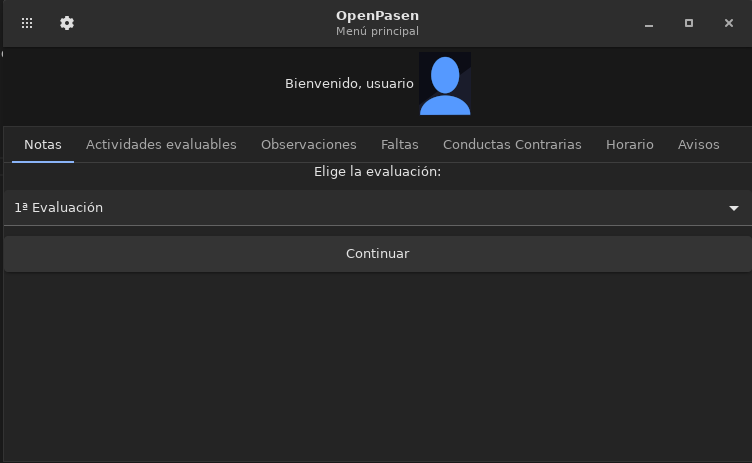

# OpenPasen

Esta es una implementación open-source distribuida bajo la licencia GPLv3 del programa de seguimiento escolar PASEN hecha en Python.

Este programa puede generar reportes, [aquí](https://htmlpreview.github.io/?https://github.com/pablouser1/OpenPasen/blob/master/examples/reporte/reporte_example.html) puedes ver un ejemplo

Actualmente testeado usando una cuenta de PASEN de alumno usando Linux, de momento no funciona con las cuentas de profesores y padres.

# Cómo usar

#### Windows:

Puedes encontrar el instalador en la sección de "releases" o en scripts/Output/openpasen_win64.exe.

También puedes instalar python junto con las librerías necesarias y ejecutar el archivo "openpython.py". Este proceso es algo más complicado.

#### Mac:

WIP

#### Linux:

Necesitas instalar las dependencias: Python 3, Glade, y las librerías requests, configparser y GTK 3.

Opcionalmente requiere BeautifulSoup para generar los reportes. Cuando tengas las dependencias puedes empezar ejecutando el archivo "openpython.py".

# TODO

#### General:

https://seneca.juntadeandalucia.es/seneca/jsp/pasendroid/getComunicaciones (Comunicaciones profe <-> alumno) | GET

https://seneca.juntadeandalucia.es/seneca/jsp/pasendroid/avisos (Avisos) | GET (Está implementada pero a veces falla)

https://seneca.juntadeandalucia.es/seneca/jsp/pasendroid/getConductasContrarias (Conductas contrarias) | POST (Incompleta)

Bug: Al generar más de un informe en una sesión comienza a duplicar entradas

Optimización

Mejorar diseño

Limpieza de código

#### Windows:

Mejorar tamaño (librerías de sobra)

Bug, Imagen del usuario de 0 bytes

Problema con caracteres UTF-8 como ñ, á...

#### Mac:

Problema con caracteres UTF-8 (usa ASCII por defecto??) no arranca

# Cómo contribuir

Este programa utiliza la API de iPASEN, las solicitudes al servidor necesarias se pueden obtener a través de logcat. Cualquiera contribución es bienvenida.